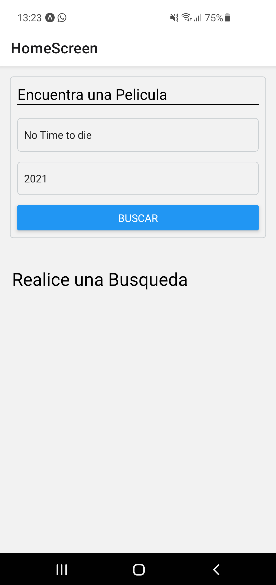
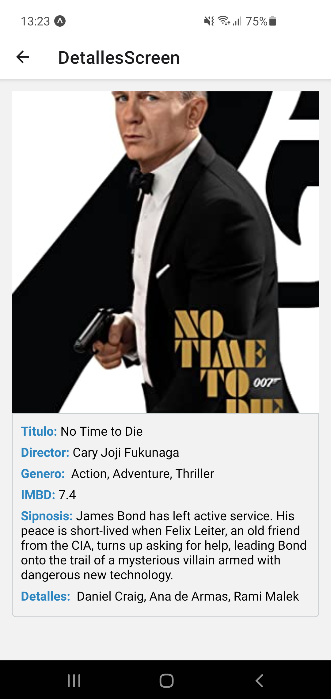
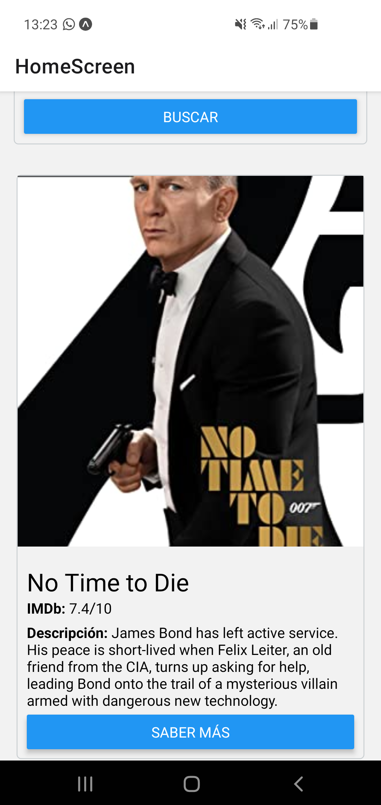

# App creada utilizando React Native + TypeScript que consulta una api de peliculas: https://www.omdbapi.com/

# obs: para que el proyeto funcione correctamente se debe agregar el archivo .env con la variable API_KEY
Imagenes:

    
    
    

